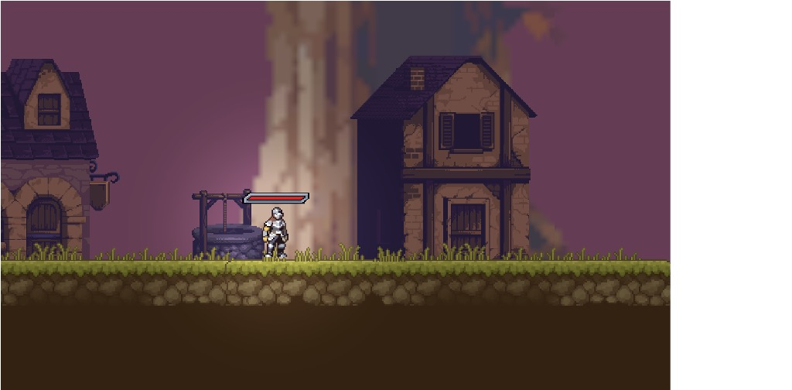
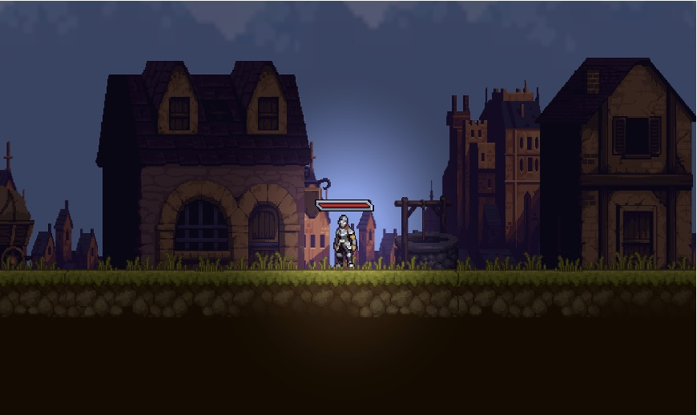
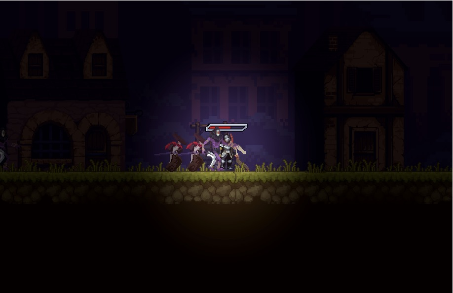

# Описание игрового проекта

## Описание игрового процесса
После старта игры персонаж попадает на первый уровень, в котором ему нужно будет перепрыгивать платформы, избегать ловушек, собирать спрятанные предметы, убивать монстров и собирать монеты и другие награды, убивать босса, чтобы улучшить характеристики. 

Второй уровень аналогичен первому, а на последнем третьем уровне игрока ждут:
- Усиленные боссы с первых двух локаций
- Финальный босс
- Магазин с улучшением снаряжения, которые значительно повысят шанс победы

## Описание ландшафта уровней
Я хотел сделать игру более атмосферной, поэтому использовал освещение на локациях, что придает живую обстановку. На каждом следующем уровне глобальное освещение уменьшается (рисунок 1, 2, 3). 

Также был наложен двойной фон с parallax эффектом, когда ближний фон движется вслед за камерой быстрее, чем задний фон. Благодаря этому создается объемность игрового мира.

## Скриншоты игры

| Уровень 1 | Уровень 2 | Уровень 3 |
|:---------:|:---------:|:---------:|
|  |  |  |
| **Рисунок 1** - Первый уровень | **Рисунок 2** - Второй уровень | **Рисунок 3** - Третий уровень |

## Скачать игру
- [Скачать Mac билд](https://disk.yandex.ru/d/aZBM_r3eYOp0bg)
